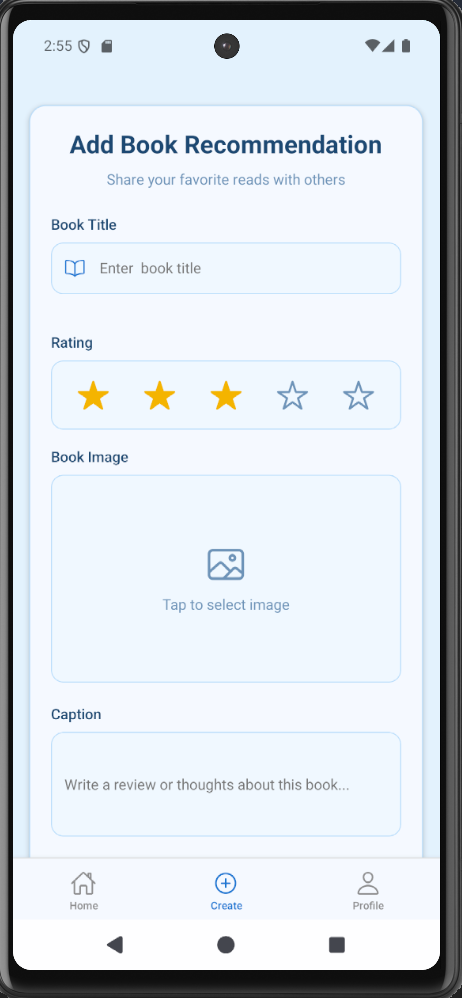
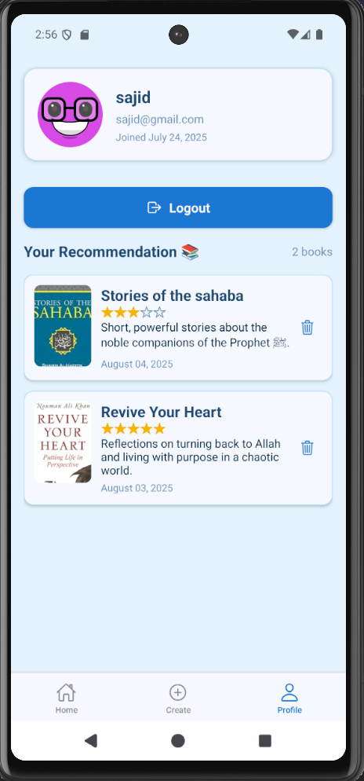

# 📚 Bookora - Book Recommendation App

Bookora is a simple mobile app built with **React Native + Expo** that allows users to share and manage personal book recommendations. Users can add and delete their own suggestions and explore recommendations from others.

---

## ✨ Features

-   ✅ Add a new book recommendation (with title, rating, caption, image)
-   🗑️ Delete your own recommendations
-   📃 View all your shared recommendations
-   🌍 Discover books recommended by other users
-   🔐 Authentication system (with secure token storage)

---

## 📲 Download APK

You can download and try the latest APK:

👉 [Download Bookora APK](https://expo.dev/accounts/sajidislam/projects/bookora-app-mobile/builds/c8c5dd5b-9f50-4779-b02e-e35359054b78)

---

## 🖼️ Screenshots

| Home Screen                                           | Add Recommendation                                      | Profile Screen                                           |
| ----------------------------------------------------- | ------------------------------------------------------- | -------------------------------------------------------- |
|  |  |  |

---

## 🔗 Backend Repository

📂 GitHub: [Bookora Backend](https://github.com/sajid-islam/Bookora-App-Backend)

---

## 🚀 Getting Started

### 1. Clone the repository

```bash
git clone https://github.com/sajid-islam/Bookora-App-Mobile
cd Bookora-App-Mobile
npm install
npx expo start

```
